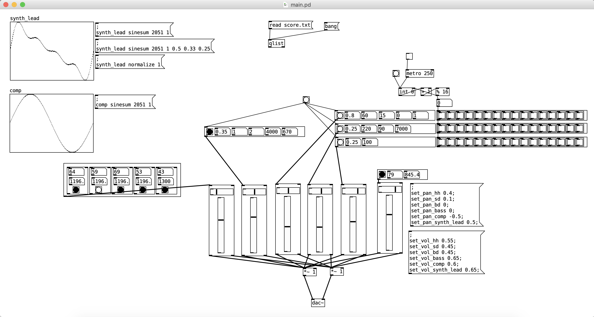

# PureData Synthesizer Band

**Course: 108-2數位聲音藝術與創作, NTU, Homework 1**  
**Contributors:** [waynes391](https://github.com/wayne391), [Phycause](https://github.com/phycause)

We build a tiny band composed of 4 synthetic instruments: **drum set(hihat, kick, sanre), bass, lead, electic organ**.

* Sample audio file: [link](data/demo.wav)
* Demo video: [link](data/demo.mov)

Given a midi, our band will perform it. Use [midi2txt.py](midi2txt.py) to convert MIDI to text file. 

---

## References:
* Bass:
    * FM synthesis: https://www.youtube.com/watch?v=mvtN7de6Oko
* Drum:
    * Kick: https://www.youtube.com/watch?v=Ksw3aCvI4Zc
    * Snare: https://www.youtube.com/watch?v=OF-7Cl3j4G4
    * Hihat: https://www.youtube.com/watch?v=kemL3pBSYfQ
* Lead and Oragn:
    * Wavetable Synthesis: https://www.youtube.com/watch?v=4QQdAT3uxmc

